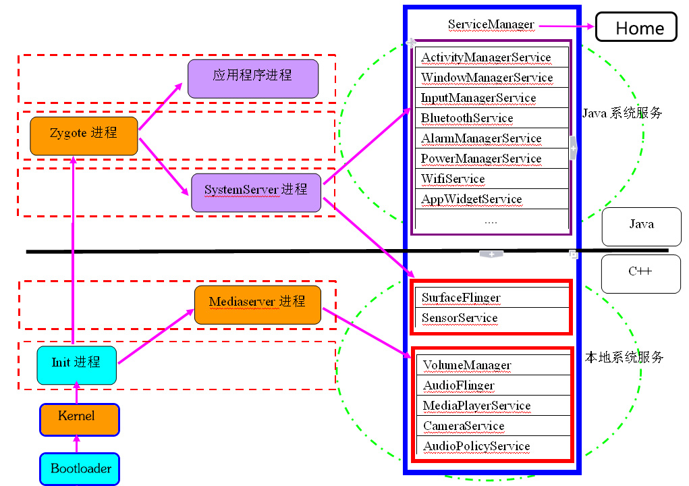
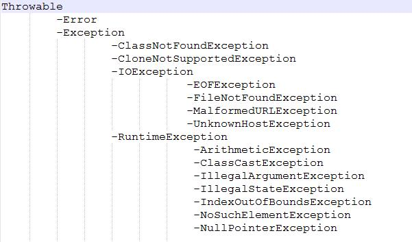

## Android知识点复习要点
---

- `View绘制流程`
- `DecorView`
- `IPC通信`
- `IntentService/Service`
	- IntentService是Service子类，创建独立的工作线程来异步处理请求。所有Intent请求处理完成后，系统会自动关闭服务，不需要调用stopSelft()来结束服务
	- Service的方法在UI线程执行 
- `Activity/Fragment生命周期（销毁和恢复）`
	- Fragment生命周期
		- onAttach()：当fragment被绑定到activity时调用
		- onCreate()
		- onCreateView()：将本身的布局构建到activity中去（fragment作为activity界面的一部分）
		- onActivityCreated()：当activity的onCreate()函数返回时被调用
		- onStart()
		- onResume()
		- onPause()
		- onStop()
		- onDestroyView()：当与fragment关联的视图体系正被移除时被调用
		- onDestroy()
		- onDetach()：当fragment正与activity接触关联时被调用  
- `Activity taskAffinity/flags/task`
	- `taskAffinity`：任务相关性，该参数标识了一个Activity所需的任务栈的名字。默认情况下，所有Activity所需的任务栈的名字为应用的包名。TaskAffinity属性主要与SingleTask启动模式活着allowTaskReparenting属性配对使用，在其他情况下没有意义 
		- 当TaskAffinity和singleTask启动模式配对使用的时候，它是具有该模式的Activity的当前任务栈的名字，待启动的Acitivity会运行在名字和TaskAffinity相同的任务栈中
		- 当TaskAffinity与allowTaskReparenting结合时，情况比较复杂，会产生特殊效果。A==> B.C ==> Home ==> B ==> show B.C not B.main
	- `Flags`
		- FLAG_ACTIVITY_NEW_TASK：singleTask模式相同
		- FLAG_ACITIVIYT_SINGLE_TOP：singleTop模式相同
		- FLAG_ACTIVITY_CLEAR_TOP：此模式在launchMode中没有对应的属性值。如果要启动的activity已经在当前的task运行则不在启动新的实例，且所有在其上面的activity将被销毁
		- FLAG_ACTIVITY_EXCLUDE_FROM_RECENTS：具有这个标志的Activity不会出现在历史Activity列表中  
- `Activity 启动模式`
	- `standard`：默认启动模式。每次启动一个Activity都会重新创建一个新的实例。谁启动了这个Activity那么这个Activity就运行在启动的那个Activity所在的栈中。从而解释了ApplicationContext无法启动standard模式的Activity
	- `singleTop`：栈顶复用模式。如果新Activity已经位于任务栈的栈顶，那么此Activity不会被重新创建，同时它的onNewIntent方法会被回调，onCreate、onStart方法不会被调用。
	- `singleTask`：栈内复用模式。先检查是否存在所需的任务栈，再检查是否存在所需实例。
	- `singleInstance`：单实例模式。如果任务栈不存在则会会创建新的任务栈	，如果存在则会将该Activity所在的Task转到前台，从而使该Activity显示出来
- `Service：默认运行在应用程序主线程中`
	- `前台服务`：前台服务必须提供一个状态栏通知，并且置于Ongoing组之下。[调用startForeground方法，使服务请求变成在前台运行。移除前台服务需要调用stopForeground方法，该方法不会终止服务。]
	- `后台服务`
	- `本地服务`：用于应用程序内部，实现一些耗时任务，会单独开辟线程在后台执行。调用Context.startService()启动，调用Context.stopService()结束。在内部可以调用Service.stopSelf()或Service.stopSelfResult()来自己停止
	- `远程服务`：调用Context.bindService()方法建立连接，Context.unbindService()关闭连接 
- `进程保活`

- Broadcast(少量、低频数据)
	- onReceiver()：`十秒限制`
	- 静态注册：AndroidManifest
	- 动态注册 : registerReceiver()／unregisterReceiver()方法
	- 广播类型
		- 普通广播：完全异步，可在同一时刻被所有接受者接收。同一级别接收先后顺序是随机的。消息传递的效率比较高，无法中断广播的传播。sendBroadCast()
		- 有序广播 ：sendOrderBroadCast()

- Android异步任务机制
	- Handler
	- AsyncTask
		- AsyncTask内部的Handler需要和主线程交互，所以AsyncTask实例必须在UI线程中创建
		- AsyncTaskResult的doInBackground()方法执行异步任务运行在子线程中，其他方法运行在主线程中
		- 一个AsyncTask任务只能执行一次
		- 默认的AsyncTask不一定会立即执行任务
- Android启动过程图解
	- 从开机到桌面过程：Bootloader ===> Kernel ===> Init进程 ===> Zygote进程 ===> SystemServer ===> ServiceManager ===>Home Launcher  
	- 图解
	
- 自定义View
	- 需要重写的方法 
		- onDraw：具体的视图都需要覆写该函数来实现自己的绘制。对于ViewGroup则不需要实现该函数，因为作为容器是“没有内容”的（但必须实现dispatchDraw()函数，告诉子View绘制自己）
		- onLayout：主要是为ViewGroup类型布局子视图用的，在View中这个函数为空函数
		- onMeasure：用于计算视图大小（长和宽）的方式，并通过setMeasuredDimension(width,height)保存计算结果
		- onTouchEvent：定义触屏事件来响应用户操作
		- 不常用方法
			- onKeyDown/onKeyUp：当松开某个键盘按键时
			- onTrackballEvent：当发生轨迹球事件时
			- onSizeChange：当该组件的大小被改变时
			- onFinishInflate：当应用从XML加载该组件并用它构建界面之后调用的方法
			- onWindowFocusChanged：当组件得到、失去焦点时
			- onAttachedToWindow：当把该组件放入到某个窗口时
			- onDetachedFromWindow：当把该组件从某个窗口上分离时触发的方法
			- onWindowVisibilityChanged：当该组件的窗口的可见性发生改变时触发  
	- `调用requestLayout()方法时会触发measure和layout过程，调用invalidate会执行draw过程`
	- 三种自定义控件方式
		- 继承已有的控件
		- 继承一个布局文件
			- 在构建函数中通过inflater和addView方法加载自定义控件的布局文件形成图形界面（不需要onDraw方法） 
		- 继承View
			- 通过onDraw方法绘制出组件界面  
- Android缓存机制
	- 内存缓存
		- LruCache类 
	-  磁盘缓存
		- DiskLruCache类	  
	-  文件缓存
	-  数据库缓存
- Android View 事件分发机制
	- dispatchTouchEvent：负责事件分发处理
		- `return true`：表示该View内部消化所有事件
		- `return false`：表示在本层不再继续进行分发，并交由上层控件的onTouchEvent方法进行消费（如果本层控件已经是Activity，那么事件将被系统消费或处理）
		- `return super.dispatchTouchEvent(ev)`，事件将分发给本层的事件拦截`onInterceptTouchEvent`方法进行处理 
	- onInterceptTouchEvent：负责事件拦截处理
		- `return true`：表示将事件进行拦截。并将拦截到的事件交由本层控件的onTouchEvent进行处理
		- `return false`：表示不对事件进行拦截。事件得以成功分发到子View。并由子View的dispatchTouchEvent进行处理
		- `return super.onInterceptTouchEvent(ev)`：默认表示拦截该事件，并将事件传递给当前View的onTouchEvent方法
	- onTouchEvent：处理触控事件
		- `return true`：表示onTouchEvent处理完事件后消费了此次事件。此时事件终止
		- `return false`：表示不响应事件，该事件将会不断向上层View的onTouchEvent方法传递，知道某个View的onTouchEvent方法返回`true`
		- `return super.dispatchTouchEvent(ev)` ：表示不响应事件，结果与`return false`一样。 
	- 子View可以通过调用`getParent().requestDisallowInterceptTouchEvent(true)`阻止ViewGroup对其`MOVE`或者`UP`事件进行拦截
	- 点击事件产生之后，传递过程：Activity ===> Window ===> View。顶级View接收到事件之后，就会按相应规则去分发事件。
	- ViewGroup默认不拦截任何事件
- SQLite
	- ACID事物
		- 原子性(Atomicity)
		- 一致性(Consistency)
		- 隔离性(Isolation)
		- 持久性(Durability)   
- Android三种菜单
	- 选项菜单`Options Menus`
		- 重写onCreateOptionsMenu用以创建上下文菜单
		- 重写onOptionsItemSelected用以响应上下文菜单 
	- 上下文菜单`Context Menus`
		- 重写onCreateContextMenu用以创建上下文菜单
		- 重写onContextItemSelected用以响应上下文菜单 
	- 弹出式菜单`Popup Menus` ：依赖于Activity中的某个视图 
- Android游戏开发中常用的三种视图
	- View：显示视图，内置画布，提供图形绘制函数、触屏事件、按键事件函数等。必须在UI主线程内更新画面，速度较慢
	- SurfaceView：基于View视图进行拓展的视图类，更适合2D游戏开发，是View的子类。类似使用双缓机制，在新的线程中更新画面所以刷新界面速度比View快
	- GLSurfaceView：基于SurfaceView视图再次进行拓展的视图类，专用于3D游戏开发的视图，OpenGL专用
		- 管理一个surface，这个surface就是一块特殊的内存，能直接排版到android的视图View上
		- 管理一个EGL display，能上OpenGL把内容渲染到上述surface上
		- 用户可自定义渲染器
		- 让渲染器在独立的线程里运行，和UI线程分离，渲染效果和速度更好
		- 支持按需渲染和持续渲染
		- 能够支持某些工具：调试
- `res/raw`和`assets`异同
	- 相同点：两者目录下的文件在打包后会原封不动的保存在apk包中，不会被编译成二进制
	- 差异点
		- `res/raw`中的文件会被影射到R.java文件中，访问时直接使用资源ID即可
		- `assets`文件夹中的文件不会被影射到R.java文件中，访问的时候需要AssetManager类
- 简述JNI调用过程
	- 安装和下载Cygwin,下载Android NDK
	- 在NDK项目中设计JNI接口
	- 使用C/C++实现本地方法
	- JNI生成动态链接库
	- 将动态链接库复制到Java工程，在Java工程中调用
- Android程序运行时权限与文件系统权限的区别
	- 运行时权限Dalvik（android授权）
	- 文件系统权限（Linux 内核授权）          	

## Java知识点复习
---

- [多线程](http://www.importnew.com/12773.html)
- ArrayList/LinkedList/Vector区别
	- ArrayList、Vector采用数组方式存储数据，索引数据快插入数据慢（`插入数据涉及数组元素移动的内存操作`）
	- LinkedList使用双向链表实现存储，插入数据快索引数据慢
	- Vector使用了synchronized方法，所以是线程安全的。性能则比ArrayList差
- Collection
	- List：有序的Collection
 		- ArrayList
 		- LinkedList
 		- Vector
 		- Stack  
 	- Set：一种不包含重复的元素的Collection。且最多有一个null元素  

- Collection与Collections区别
	- Collection是集合继承结构中的顶层接口
	- Collections是提供了对集合进行操作的强大方法的工具类。包含有各种有关集合操作的静态多态方法。此类不能实例化  

- Throwable继承关系图

	
- HashTable和HashMap的区别
	- HashTable
		- 继承自Dictionary，实现Map接口
		- 键、值都不能是空对象
		- 多次访问，映射元素顺序相同
		- 线程安全
		- hash算法，Hashtable直接利用key本身的hash码来做验证
		- 数据遍历方式Iterator(支持fast-fail)和Enumeration(不支持fast-fail)
		- 缺省初始长度为11，内部都为抽象方法
	- HashMap
		- 继承自AbstractMap抽象类
		- 键、值都可以是空对象
		- 多次访问，映射元素顺序可能不同
		- 非线程安全[`HashMap可以通过下面的语句进行同步：Map m = Collections.synchronizeMap(hashMap);`]
		- 检测是否含有key时，HashMap内部需要将key的hash码重新计算一遍再检测
		- 数据遍历方式Iterator(支持fast-fail)	
		- 缺省初始长度为16，内部已经实现了Map所需要做的大部分工作
			 
	
----
+ [ ] Android基础知识复习
+ [ ] Java基础知识复习
+ [ ] Android项目复习
+ [ ] RN知识点复习
+ [ ] HTTP／HTTPS + TCP/IP复习
+ [ ] 数据结构
+ [ ] 基础算法

## 网络知识
---

+ 网络架构
+ TCP三次握手／四次挥手
+ TCP滑动窗口机制
+ TCP拥塞控制机制
+ Socket模型


## 数据结构

---
### 稳定性：相等数值对象是否会因为排序而改变原始相对位置，如果改变则为不稳定，否则为稳定。

### 排序算法
+ 冒泡排序
	+ 最差时间复杂度/平均时间复杂度：`O(n^2)`
	+ 最优时间负责度：`O(n)`
	+ 最差空间复杂度：总共`O(n)`，需要辅助空间`O(1)`

```javascript
function bubbleSort(arr) {
	var temp,
		len = arr.length;
	for (var i=0; i< len-1; i++) {
		for (var j=0; j< len-1-i; j++) {
			if (arr[j] > arr[j+1]) {
				// 从下到大排列
				temp = arr[j];
				arr[j] = arr[j+1];
				arr[j+1] = temp;
			}
		}
	}
}
``` 

+ 选择排序
	+ 简单选择排序
		+ 最差时间复杂度/平均时间复杂度：`O(n^2)`
		+ 最优时间复杂度：`O(n)`
	
	```javascript
	function simpleSort(arr) {
		var temp,
			len = arr.length;
		for (var i=0; i < len-1; i++) {
			var min = i;
			for ( var j= i+1; j < len; j++) {
				if (arr[j] < arr[min]) {
					min = j;
				}
			}
			if ( min != i) {
				temp = arr[min];
				arr[min] = arr[i];
				arr[i] = temp;
			}
		}
	}
	```
	+ 堆排序 
		+ 大根堆：每个节点的值都不大于父节点的值
		+ 在堆的数据结构中，堆中的最大值总是位于根节点
		+ 创建最大堆：将堆所有的数据重新排序
		+ 堆排序：移除位在第一个数据的根节点，并做最大堆调整的递归运算
		+ 通常堆是通过一维数组来实现的。在数组其实位置为0的情形中：
			+ 父节点i的左子节点在位置(2 * i + 1)
			+ 父节点i的右子节点在位置(2 * i + 2)
			+  子节点i的父节点在位置floor((i-1)/2)

+ 希尔排序——插入类排序（减少增量法）
	+ 最差时间复杂度/平均时间复杂度：`O(n^2)/O(n^1.3)`
	+ 最优时间复杂度：`O(n)` 

```javascript
function shellSort(arr) {
	var temp,
		fraction,
		len = arr.length;
	for (fraction = Math.floor(len / 2); fraction >0 ; fraction = Math.floor(fraction / 2)) {
		console.log(fraction);
		for (var i = 0; i < len; i++) {
			var j = i + fraction;	
			if (j< len && arr[i] > arr[j]){
				temp = arr[j];
				arr[j] = arr[i];
				arr[i] = temp;
			}		
		}
		console.log('result', arr);
	}
}
``` 

+ 归并排序——分治法
	+ 速度仅次于快速排序，为稳定排序算法
	+ 平均／最坏／最好时间复杂度：`O(nlog2n)／O(nlog2n)／O(nlog2n)`
	+ 空间复杂度： `O(n)`

```javascript
// 递归实现
function merge(left,right) {
	var result = [];
	while (left.length > 0 && right.length > 0) {
		if (left[0] < right[0]) {
			result.push(left.shift());
		} else {
			result.push(right.shift());
		}
	}
	return result.concat(left).concat(right);
}
function mergeSort(arr) {
	if (arr.length <= 1) {
		return arr;
	}
	var middle = Math.floor(arr.length/2),
		left = arr.slice(0,middle),
		right = arr.slice(middle);
	console.log('result','middle',middle,'left',left,'right',right);
	return merge(mergeSort(left), mergeSort(right));
}
```

```javascript
// 迭代实现
```

+ 快速排序算法：又称为划分交换排序——冒泡排序的改进
	+ 平均／最差／最优时间复杂度：`O(nlogn)/O(n^2)/O(nlogn)`

```javascript
function quickSort(arr) {
	if (arr.length <= 1) { return arr; }
	var pivotIndex = Math.floor(arr.length/2);
	var pivot = arr.splice(pivotIndex, 1)[0];
	var left = [],
		right = [];
	for (var i=0; i< arr.length; i++) {
		if (arr[i] < pivot) {
			left.push(arr[i]);
		} else {
			right.push(arr[i]);
		}
	}
	return quickSort(left).concat([pivot], quickSort(right));
}
```
+ 桶排序：箱排序
	+ 平均／最差时间复杂度：`O(n+k)/O(n^2)`
	+ 最差空间复杂度：O(n*k) 
+ 基数排序
+ 插入排序
