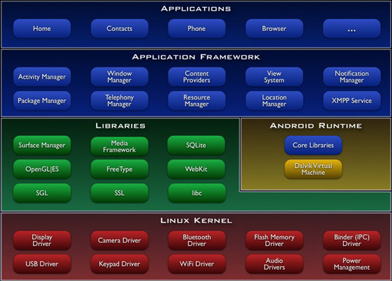

## Android 群英传笔记
---
+ Android系统架构
	+ Linux内核层：最底层最核心部分
		+ 硬件驱动
		+ 进程管理
		+ 安全系统
		+ 等等 
	+ 库和运行时
		+Dalvik与ART（`Android 5.X版本以后ART取代Dalvik`）
		
		+ 两者区别： 
	+ Framework层
	+ 应用层



+ Context创建时间：（创建Context的实现类的时候）
	+ 创建Application
	+ 创建Activity
	+ 创建Service
getApplicationContext()方法获取的是整个App的Context
+ Makefile：自动化编译Android代码（可定义编译规则，打包规则等）
+ Android系统目录
	+ /system/ 目录 
		+ /system/app/：系统App文件目录
		+ /system/bin/：Linux自带组件目录
		+ /system/build.prop：系统的属性信息
		+ /system/fonts/：系统字体存放目录（root后可下载TTF格式字体替换原字体，从而到达修改系统字体效果）
		+ /system/framework/：系统的核心文件、框架层
		+ /system/lib/：存放几乎所有的共享库(so)文件
		+ /system/media/：存放系统提示音、系统铃声
		+ /system/usr/  ：用户配置文件（键盘布局、共享、时区文件等）
	+ /data/(用户大部分数据信息)
		+ /data/app/：用户安装的App或者升级的App
		+ /data/data/：App的数据信息、文件信息、数据库信息等（以包名来区分各个应用）
		+ /data/system/：包含手机的各项系统信息
		+ /data/misc/：保存了大部分的WI-FI、VPN信息
+ View（以树形结构形式存在，上层控件负责下层控件的测量与绘制，并传递交互事件） 
	+ Android界面的架构图：(自顶向下)
		+ Activity：每个Activity都包含一个Window对象
			+ PhoneWindow：Android中Window对象
				+ DecorView：整个应用窗口的根View，封装了一些窗口操作的通用方法（所有的View的监听事件，都通过Window ManagerService来接收，并通过Activity对象来回调相应的onClickListener）
					+ TitlteView
					+ ContentView ：ID为content的

 FrameLayout，activity_main.xml就是设置在这里面
 
+ 自定义View的核心方法
 	+ onMeasure():MeasureSpec类，用于测量View大小
 		+ EXACTLY：具体数值/`match_parsent`
 		+ AT_MOST：`wrap_content`，控件大小跟随子控件或者内容的变化而变化
 		+ UNSPECIFIED ：不限制View大小
 	
 	（`如果要让自定义的View支持wrap_content属性，则必须重写onMeasure方法`）
 	
 	+ onDraw()：通过bitmap与画布Canvas关联起来（解耦合）
 	+ onLayout()：定位View位置
 	+ onFinishInflate()：从XML加载组件中后回调
 	+ onSizeChanged()：组件大小改变时回调
 	+ onTouchEvent() ：监听到触摸事件时回调
 
 + ViewGroup/View的事件拦截（`True--拦截，false--不拦截`）
 	+ dispatchTouchEvent：事件分发的第一步
 	+ onInterceptTouchEvent：`决定ViewGroup是否将事件传入到子View中去` 
 	+ onTouchEvent：事件的最后处理
 
+ ListView使用技巧
 	+ ViewHolder优化（提高复用率）
 	+ devider/deviderHeight：设置项目间分割线
 	+ 取消ListView Item点击效果：listSelector="@android:color/transparent"
 	+ 处理空listView：listView.setEmptyView(R.id.xxx)
 	+ 有弹性的ListView：通过重写方法overScrollBy，设置maxOverScrollY数值到达预期效果
 	+ 通过ViewType/getViewTypeCount动态加载不同类型布局
+ ScrollView分析
 	+ Android坐标系：屏幕最左上角的顶点作为Android坐标系原点，从原点向右是X轴正方向，从原点向下是Y轴正方向（`getLocationOnScreen()获取Android坐标系中点的位置。在触摸事件中使用getRawX/getRawY方法获取到的同样是Android坐标系中的坐标`）
 	+ 视图坐标系：描述子视图在父视图中的位置关系，X/Y轴的方向与Android坐标系相同，但是视图坐标系的原点是以父视图左上角作为原点(`在触控事件中，通过getX/getY方法获取到的坐标就是视图坐标系中的坐标`)
 	+ 实现滑动的七种方法
 		+ layout方法：通过在ACTION_MOVE事件获取移动偏移量，再通过layout方法设置显示位置(`layout(getLeft()+offsetX,getTop()+offsetY,getRight()+offsetX,getBottom()+offsetY);`)
 		+  offsetLeftAndRight/offsetTopAndBottom方法：方法原理同layout方法
 		+  LayoutParams：通过getLayoutParams()获取LayoutParmas对象修改布局参数到达改变View位置的效果（`必须知道父布局类型`），或者通过使用ViewGroup.MarginLayoutParams来实现相应效果（`无需知道父布局类型`）
 		+  scrollTo/scrollBy：移动的是View的content（`ViewGroup移动的是所有的子View`）
 			+ scrollTo(x,y)：表示移动到一个具体的坐标点(x,y)
 			+ scrollBy(dx,dy)：表示移动的增量dx、dy 
 		+  Scroller类：可以实现平滑移动的效果，而不是瞬间完成的移动
 			+ 使用步骤
 				+ 初始化Scroller
 				+ 重写computeScroll方法，实现模拟滑动（`系统在绘制View的时候会在draw方法中调用该方法，这个方法实际上就是实用的scrollTo方法。computeScroll方法不会自动调用，只能通过invalidate()-->draw()-->computeScroll()来间接调用computeScroll方法`）   
 				+ startScroll开启模拟过程
 		+ 属性动画
 		+ ViewDragHelper：基本可以实现各种不同的滑动、拖放需求
 			+ 初始化ViewDragHelper(`mViewDragHelper = ViewDragHelper.create(this,callback)`)
 			+ 拦截事件：重写拦截事件，将事件传递给ViewDragHelper进行处理
 	
			 	```
			 	@Override
			 	public boolean onInterceptTouchEvent(MotionEvent ev){
			 		return mViewDragHelper.shouldInterceptTouchEvent(ev);
			 	}
			 	@Overried
			 	public boolean onTouchEvent(MotionEvent event){
			 		mViewDragHelper.proccessTouchEvent(event);
			 		return true;
			 	}
			 	``` 
	  		+ 处理computeScroll()
	  			
	  			```
	  			@Override
	  			public void computeScroll(){
	  				if(mViewDragHelper.continueSetting(true)){
	  					ViewCompat.postInvalidateOnAnimation(this);
	  				}
	  			}
	  			```
 			+ 处理回调Callback
 
 Google在其support库中提供了DrawerLayout和SlidingPaneLayout两个布局来帮助开发者实现侧边栏滑动的效果。
 
 + Android绘图机制
 	+ Android XML绘图
 		+ Bitmap
 			
 			```
 			<?xml version="1.0" encoding="utf-8">
 			<bitmap 
 				xmlns:android="http://schemas.android.com/apk/res/android"
 				android:src="@drawable/ic_launcher"/>
 			```
 		+ Shape
 			+ corners：当shape为rectangle时使用
 			+ gradient：渐变
 			+ padding
 			+ size：指定大小，一般用在imageView配合scaleType属性使用
 			+ solid：填充颜色
 			+ stroke：指定边框 
 		+ Layer：图层效果
 			
 			```
 			<?xml version="1.0" encoding="utf-8">
 			<layer-list xmlns:android="http://schemas.android.com/apk/res/android">
 			<item android drawable="@drawable/ic_launcher"/>
 			<item android drawable="@drawable/ic_launcher"
 				    android:left="10dp"
 				    android:top="10dp"/>
 			</layer-list>
 			``` 
 		+ Selector：实现静态绘图中的事件反馈
 	+ Canvas
 		+ Canvas.save：保存画布，将之前的所有已绘制图像保存起来，让后续的操作就像在一个新图层上操作一样
 		+ Canvas.restore：将已保存的所有图像进行合并
 		+ Canvas.translate：坐标系平移
 		+ Canvas.rotate ：坐标系旋转
 	+ Layer：基于栈的结构进行管理
 		+ saveLayer/saveLayerAlpha将一个图层入栈（生成一个新的图层）
 		+ restore/restoreToCount将一个图层出栈	 
	+ SurfaceView与View之间的区别（16ms，`如果自定的View需要频繁刷新，或者刷新时数据处理量比较大时应该使用SurfaceView代替View`）
		+ View主要适用于主动更新的情况下，而SurfaceView主要适用于被动更新（`例如频繁刷新`）
		+ View在主线程中对画面进行刷新，而SurfaceView通常会通过一个子线程来进行页面刷新
		+ View在绘图时没有使用双缓冲机制，而SurfaceView在底层实现机制中实现了双缓冲机制


+ Android 动画
	+ 视图动画：每次绘制视图时View所在的ViewGroup中的drawChild函数获取该View的Animation的Transformation值，然后调用canvas.concat(transformToApply.getMatrix())，通过矩阵运算完成动画帧。
		+ AlphaAnimation
		+ RotateAnimation
		+ TranslateAnimation
		+ ScaleAnimation
	(`AnimationSet将动画以组合的形式展现出来`) 
	+ 属性动画 ：（`解决Android 3.0之前动画框架存在的局限——动画之改变显示不能响应事件`）
		+ ObjectAnimator
			+ 自动驱动
			+ 可以通过调用setFrameDelay(longframeDelay)设置动画帧之间的间隙时间，调整帧率，减少资源消耗
			+  通过调用属性的get、set方法来真实地控制一个View的属性
				+  translationX/translationY
				+  rotation/rotationX/rotationY
				+  scaleX/scaleY：
				+  pivotX/pivotY：中心点位置
				+  x/y：最终位置
				+  alpha
			+ 没有get、set方法的属性
				+ 自定义一个属性类或者包装类，间接的给所需属性增加get、set方法
				+ 通过ValueAnimator类来实现
		+ PropertyValuesHolder：类似视图动画中的AnimationSet。通过ObjectAnimator.ofPropertyValuesHolder(view,pvh1,pvh2,pvh3)实现多个属性动画的共同作用 
		+ AnimatorSet：能实现多个属性动画效果，同时能够精确控制执行顺序
	+ 布局动画：作用在ViewGroup上（`geiViewGroup增加View时添加一个动画过渡效果`）
		+ 通过在ViewGroup的XML中，添加`android:animateLayoutChanges="true"`属性打开默认动画效果(`逐渐显示的过渡效果`) 
		+ 通过LayoutAnimationController类自定义子View的过渡效果
